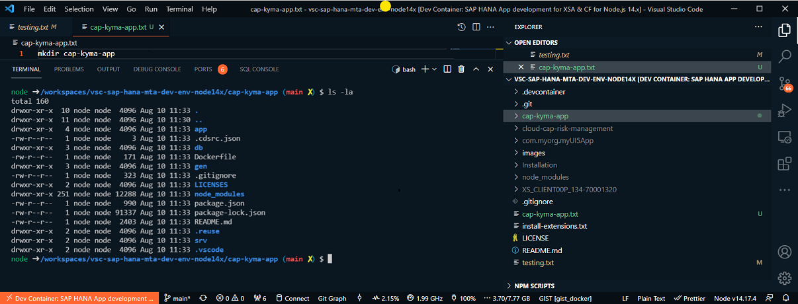
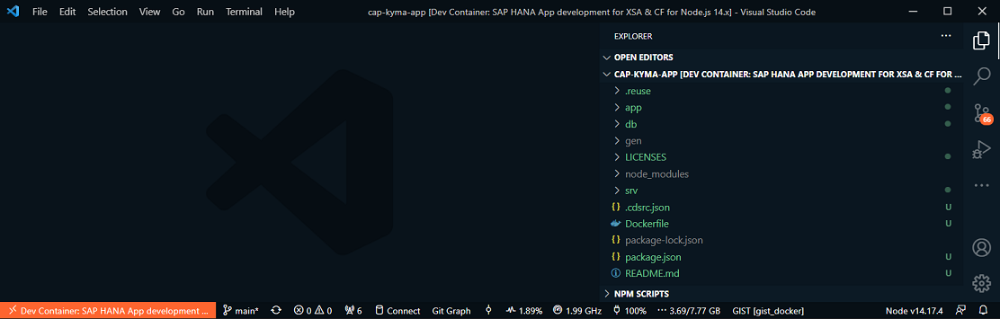
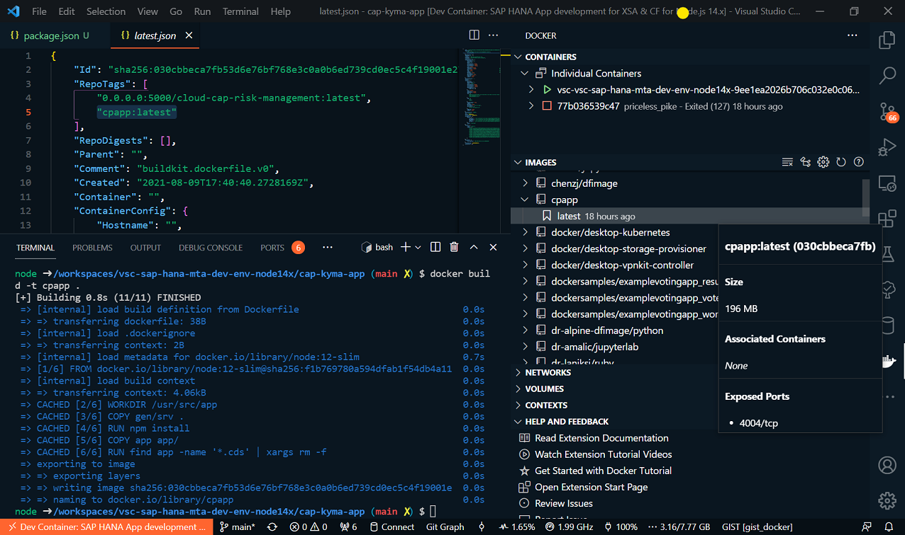
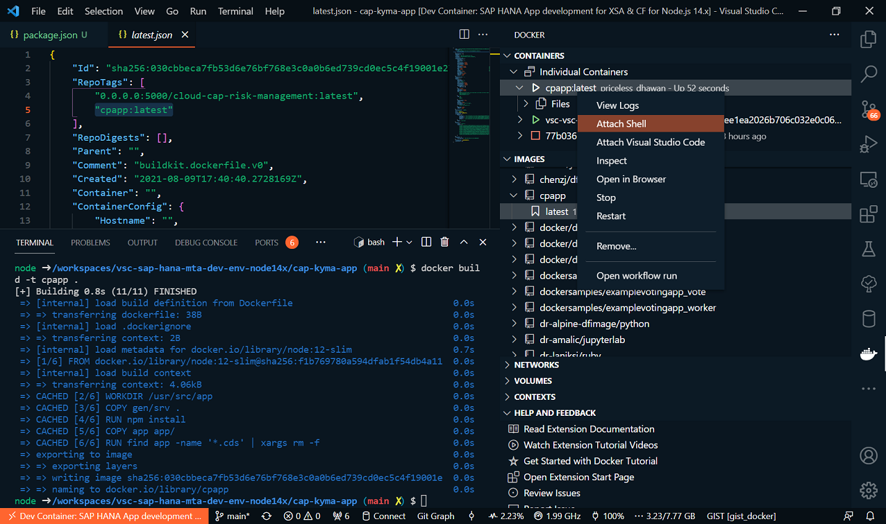
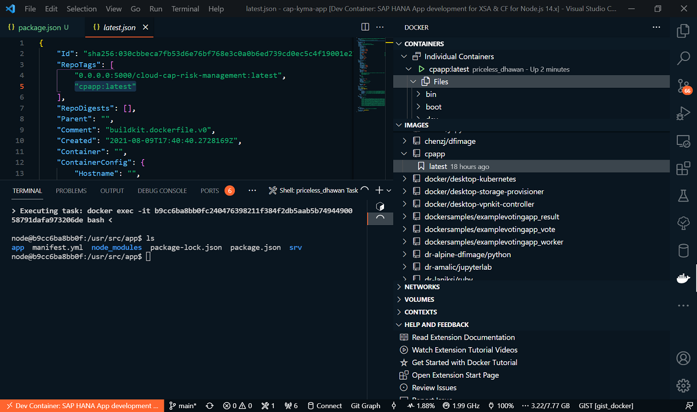
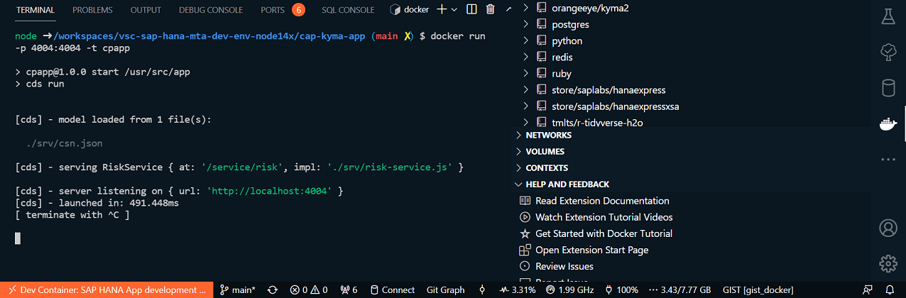
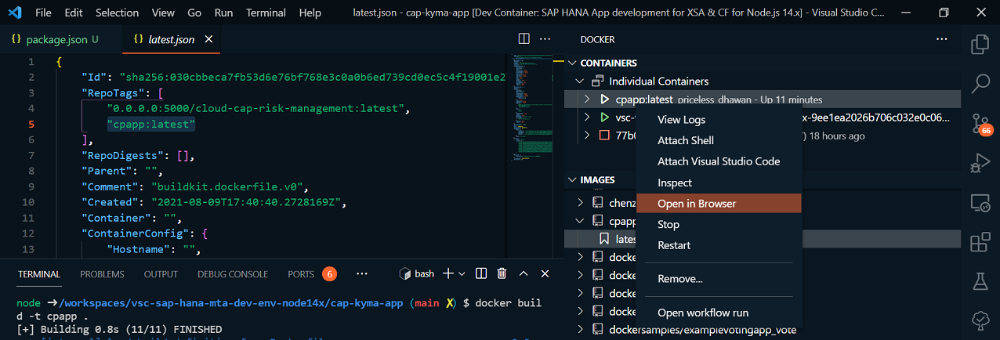
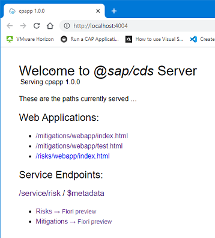
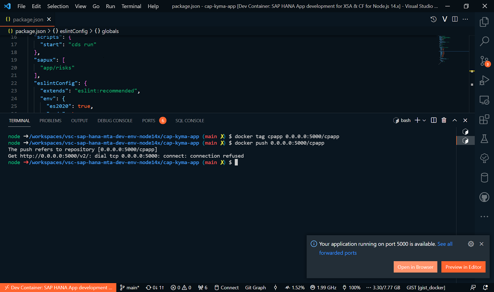

# My walkthrough for the tutorial "[Run a CAP Application on Kyma](https://sap-samples.github.io/cloud-cap-risk-management/Kyma/)" with this [VS Dev Container](https://github.com/draschke/vsc-sap-hana-mta-dev-env-node14x/blob/ef0b07b2c5621b9daead27db90d8c2f1ace6bc2a/.devcontainer)

- You can follow all the steps that are described here, without to install anything else, unless I have mentioned it. In this walkthrough you will find only additional hint.
[Run a CAP Application on Kyma](https://sap-samples.github.io/cloud-cap-risk-management/Kyma/)

## Run the CAP Application in a Docker Container Locally



## Run the CAP App in an own folder with command "code ."

```bash
node ➜ /workspaces/vsc-sap-hana-mta-dev-env-node14x/cap-kyma-app (main ✗)
code .  
```



### 4. Build the docker image locally
  
```bash
node ➜ /workspaces/vsc-sap-hana-mta-dev-env-node14x/cap-kyma-app (main ✗)
docker build -t cpapp . 
    --> Image: cpapp:latest (030cbbeca7fb)   
```



## Run the Docker Container

### 4. Run the container again with the publish parameter

```bash
node ➜ /workspaces/vsc-sap-hana-mta-dev-env-node14x/cap-kyma-app (main ✗)
docker run -p 4004:4004 -t cpapp 
    --> Image: cpapp:latest (030cbbeca7fb)   
```

### 4. Check for the created container

### Attach Shell



### Check for your files: commad ls



### Run the container using the side bar of VS Code







## Log In to Kyma (Kubernetes Cluster)

### Get your Kubeconfig as described (CF Login required)

### Update your kubeconfig.yml  (keep in mind, secrets on Kyma are changing all 8 hours (I guess))
  
```bash
node ➜ /workspaces/vsc-sap-hana-mta-dev-env-node14x/cap-kyma-app (main ✗)
env | grep KUBECONFIG
KUBECONFIG=/usr/local/share/kube-devcontainer/kubeconfig.yml   
```

### Check for your pods, if you have any

```bash
node ➜ /workspaces/vsc-sap-hana-mta-dev-env-node14x/cap-kyma-app (main ✗)
kubectl get pods
No resources found in default namespace.
```

### Check for your namespaces

```bash
node ➜ /workspaces/vsc-sap-hana-mta-dev-env-node14x/cap-kyma-app (main ✗)
kubectl get namespaces
NAME               STATUS   AGE
compass-system     Active   8d
default            Active   8d
```

## I did this "Prepare the Docker Registry"

### 1. Add the stable Helm Chart repository to the helm CLI

```bash
node ➜ /workspaces/vsc-sap-hana-mta-dev-env-node14x/cap-kyma-app (main ✗)
helm repo add stable https://charts.helm.sh/stable
```

### 2. Install the Helm Chart for a docker registry

```bash
node ➜ /workspaces/vsc-sap-hana-mta-dev-env-node14x/cap-kyma-app (main ✗)
helm install docker-registry stable/docker-registry
```

### 3. You need to make the docker registry available on the public internet. The details to this step are explained later. Run the following commands

```bash
node ➜ /workspaces/vsc-sap-hana-mta-dev-env-node14x/cap-kyma-app (main ✗) 
kubectl apply -f - <<EOF
apiVersion: gateway.kyma-project.io/v1alpha1
kind: APIRule
metadata:
  labels:
    app: docker-registry
  name: docker-registry
spec:
  service:
    host: docker-registry
    name: docker-registry
    port: 5000
  gateway: kyma-gateway.kyma-system.svc.cluster.local
  rules:
    - path: /.*
      methods: ["GET", "HEAD" ]
      accessStrategies:
        - handler: noop
      mutators: []
EOF
```

## Push the docker image (my journey comes to the end)

```bash
node ➜ /workspaces/vsc-sap-hana-mta-dev-env-node14x/cap-kyma-app (main ✗)
kubectl port-forward deployment/docker-registry 5000:5000 &
[1] 6219

node ➜ /workspaces/vsc-sap-hana-mta-dev-env-node14x/cap-kyma-app (main ✗) 
my output:
Forwarding from 127.0.0.1:5000 -> 5000

node ➜ /workspaces/vsc-sap-hana-mta-dev-env-node14x/cap-kyma-app (main ✗)
docker push 0.0.0.0:5000/cpapp
The push refers to repository [0.0.0.0:5000/cpapp]
Get http://0.0.0.0:5000/v2/: dial tcp 0.0.0.0:5000: connect: connection refused
```

### Issue: It don't see this expected output

```bash
Forwarding from 127.0.0.1:5000 -> 5000
Forwarding from [::1]:5000 -> 5000
```



## Any help to solve the problem would be great

[Issue Push Image failed](https://github.com/draschke/vsc-sap-hana-mta-dev-env-node14x/issues/5)