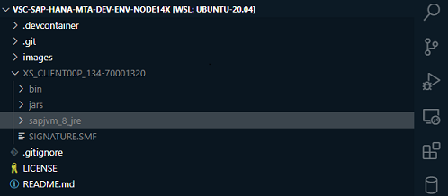

# Kick off your SAP HANA App Dev Env for running Hana-Cli (XSA & CF) by leverage VS Code Dev Container. Use this [devcontainer](https://github.com/draschke/vscode-sap-hana-dev-env-for-running-hana-cli/tree/main/.devcontainer) for your projects if you want

## Motivation

The approach of this project was to share the same required dev environment by using the same VS Code Dev Containers to make the start for new team members more easy and faster.

## Prerequisites

- [Install Docker Desktop on Windows](https://docs.docker.com/docker-for-windows/install/)

- [Install this VS Code Containers extension at first](https://code.visualstudio.com/docs/remote/containers-tutorial#_install-the-extension)

- XS Client for SAP HANA XSA (Only required for connecting a XSA platform)
  
[Download the XS_CLIENT00P_xxx-70001320 for Linux from SAP Download Center](https://launchpad.support.sap.com/#/softwarecenter/template/products/related/_APP=00200682500000001943&_EVENT=DISPHIER&HEADER=Y&FUNCTIONBAR=N&EVENT=TREE&NE=NAVIGATE&ENR=73554900100900001301&V=MAINT/SAP%20HANA%20PLATFORM%20EDITION%202.0)  

  Drop the unzipped XS_CLIENT00P file on root  

  
Change the path in your .devcontainer\Dockerfile

- (ENV XSCLI="/workspaces/cap-vscode-dev-container/XS_CLIENT00P_134-70001320)

Change the permission by running your WSL - Distro with the chmod command.

```bash
node ➜ /workspaces/vsc-sap-hana-mta-dev-env-node14x/XS_CLIENT00P_134-70001320/bin (docs ✗)
$ chmod -R +x xs
```

```bash
node ➜ /workspaces/vsc-sap-hana-mta-dev-env-node14x/XS_CLIENT00P_134-70001320/sapjvm_8_jre/ (docs ✗)
$ chmod -R +x bin
```

### Hints

Running project in WSL (Ubuntu)

- For performance reason run the project in the Linux file system (~/home)
- You'll find your Linux home directory on Windows here:
  
```bash
\\wsl$
\\wsl$\Ubuntu-20.04\home\
```

- If you want, use the same Extensions in WSL by running this file [code --install-extension](https://github.com/draschke/vsc-sap-hana-mta-dev-env-node14x/blob/main/install-extensions.txt)

```bash
code --install-extension "christian-kohler.path-intellisense"
code --install-extension "christian-kohler.npm-intellisense"
...
```

#### This VS Dev Container includes  

#### OS

- OS Debian

#### CLIs

- [XS Client (XSA)](https://launchpad.support.sap.com/#/softwarecenter/template/products/related/_APP=00200682500000001943&_EVENT=DISPHIER&HEADER=Y&FUNCTIONBAR=N&EVENT=TREE&NE=NAVIGATE&ENR=73554900100900001301&V=MAINT/SAP%20HANA%20PLATFORM%20EDITION%202.0)
- [CF Client (Cloud Foundry)](https://docs.cloudfoundry.org/cf-cli/install-go-cli.html#pkg-linux)
- [HANA Client](https://www.npmjs.com/package/hana-cli)
- [Kubernetes](https://kubernetes.io/docs/tasks/tools/install-kubectl-linux/)
- [Docker](https://code.visualstudio.com/docs/containers/choosing-dev-environment#_enabling-docker-cli-inside-a-remote-development-environment)

#### VS Code Extensions

- A lot of nice extensions
  
#### NPMs for CAP & Fiori Dev

- [@sap/cds-dk yo](https://www.npmjs.com/package/@sap/cds-dk)
- [@sap/generator-fiori](https://www.npmjs.com/package/@sap/generator-fiori)
- @sap/generator-add-hdb-module
- @sap/generator-base-mta-module
- @sap/generator-cap-project
- @sap/generator-hdb-project
- [@sapui5/generator-sapui5-templates](https://www.npmjs.com/package/@sapui5/generator-sapui5-templates)
- typescript
- [docker](https://docs.docker.com/get-docker/)

#### My tutorials with VS Code Dev Container

- [SAP App Development with VS Code](https://draschke.github.io/my-SAP-exercises-with-VSCode/).

#### Microsoft - VS Code Dev Container

- [Remote development in Containers](https://code.visualstudio.com/docs/remote/containers-tutorial)
- [Developing inside Container](https://code.visualstudio.com/docs/remote/containers)
- [Docker Hub](https://hub.docker.com/_/microsoft-vscode-devcontainers)
- [Microsoft Dev Container on Github](https://github.com/microsoft/vscode-dev-containers)  

#### Nice blog "SAP CAP VS Code dev container" written by @htammen

- [Develop SAP CAP apps inside a VS Code Docker Container](https://blogs.som/2020/02/20/develop-sap-cap-apps-inside-a-vs-code-docker-container/)

#### HANA CLI by @jung-thomas

- [SAP HANA Developer Command Line Interface](https://github.com/SAP-samples/hana-developer-cli-tool-example)

### Contributing

- Contribute or provide feedback for this repo
- Consider to use [Discussions](https://github.com/draschke/vsc-sap-hana-mta-dev-env-node14x/discussions)
- Search existing issues or report a problem

### License

Copyright (c) 2021 Dirk Raschke. All rights reserved. This project is licensed under the MIT License.
